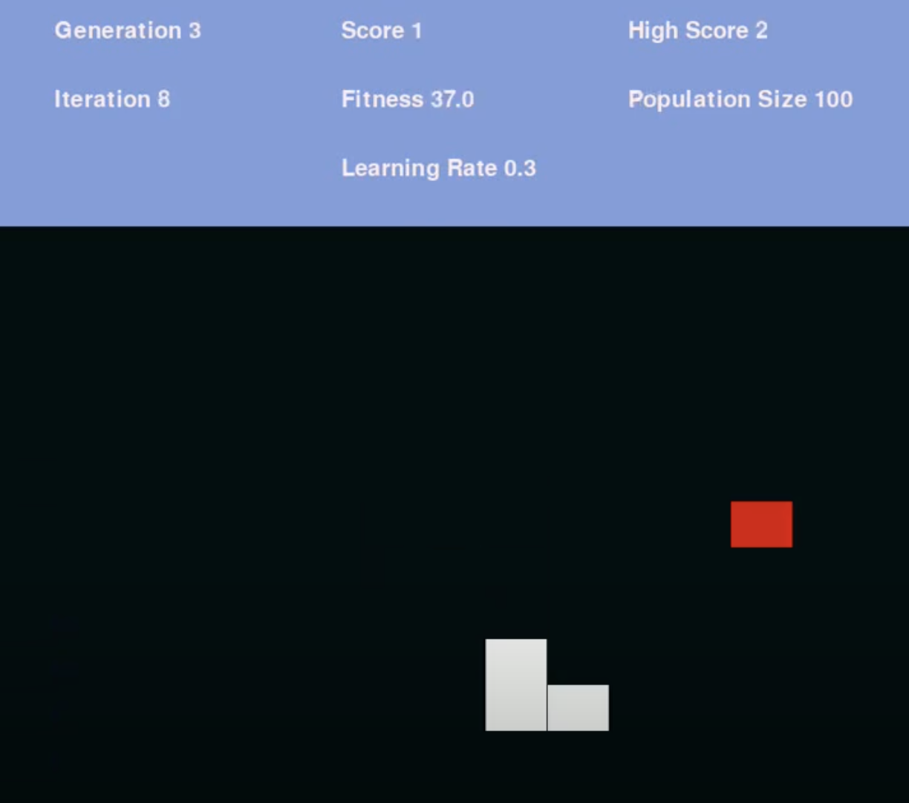

# Snake AI

A genetic algorithim that gradually increases an AI's performance at the game 'Snake'

# How to Use
  -
      - 'Main.py': Trains the snake AI and creates a video playback of the performance of the best AI in each generation
      - 'AIPlay.py': Pick a model in the 'Models' directory to play snake for you
      - 'Play.py': Play snake yourself
      - 